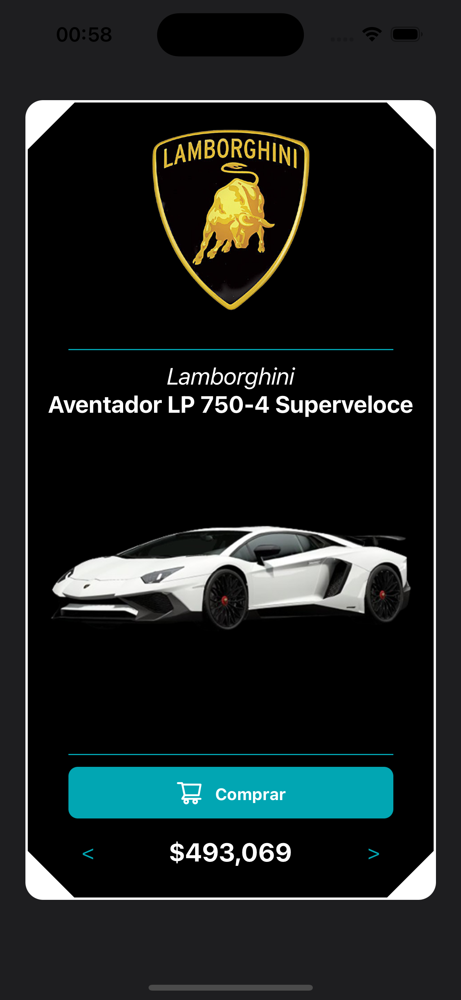
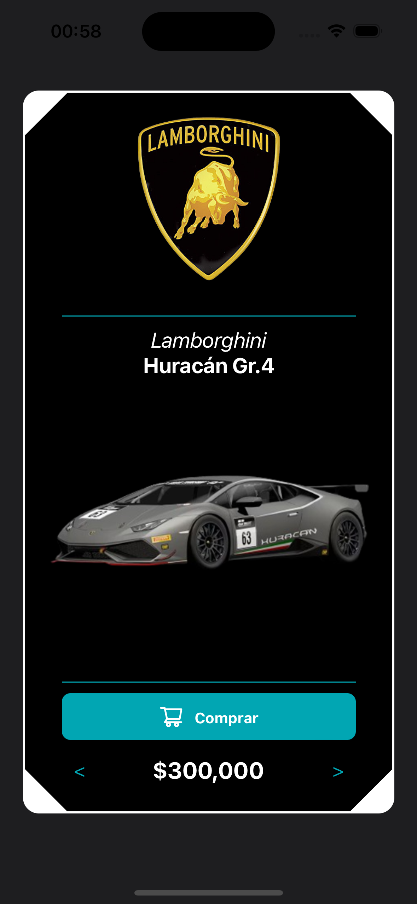
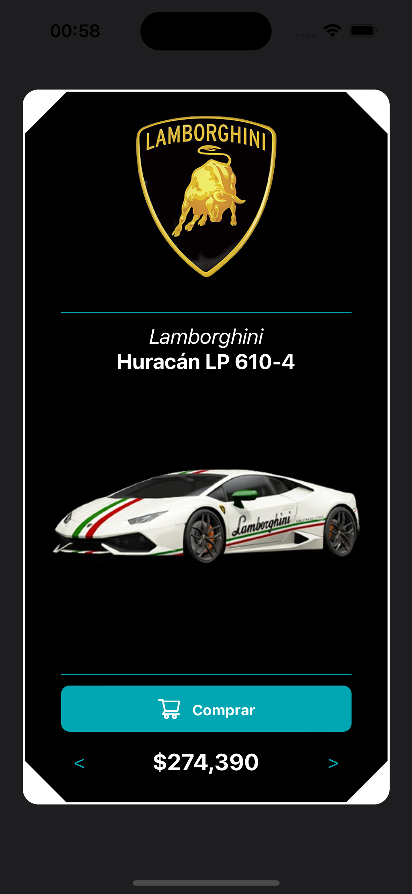

# Aplicativo de Catálogo da Lamborghini

Este é um aplicativo desenvolvido em React Native que lista opções de compra para carros. Ele permite que os usuários naveguem entre diferentes modelos de carros como se estivessem em um catálogo consumindo um API fake apenas para fins didáticos.

## Screenshots

## Recursos

- Visualização de diferentes modelos de carros da Lamborghini.
- Opção de compra online.
- Interface amigável e fácil de usar.

## Como começar

Para iniciar o aplicativo, siga as instruções abaixo:

1. Clone o repositório para a sua máquina local `git clone https://github.com/edwinbustillos/app-cars-react-native.git`.
2. Navegue até a pasta do projeto.
3. Instale as dependências do projeto com o comando `npm install`.
4. Inicie o aplicativo com o comando `npm run ios` ou `npm run android`.

## Dependências

Este projeto utiliza as seguintes dependências:

- axios: ^1.6.7
- expo: ~50.0.8
- expo-status-bar: ~1.11.1
- react: 18.2.0
- react-native: 0.73.4
- @babel/core: ^7.20.0
- @types/react: ~18.2.45
- typescript: ^5.1.3

## Contribuição

Contribuições são sempre bem-vindas. Sinta-se à vontade para abrir uma issue ou enviar um pull request.
